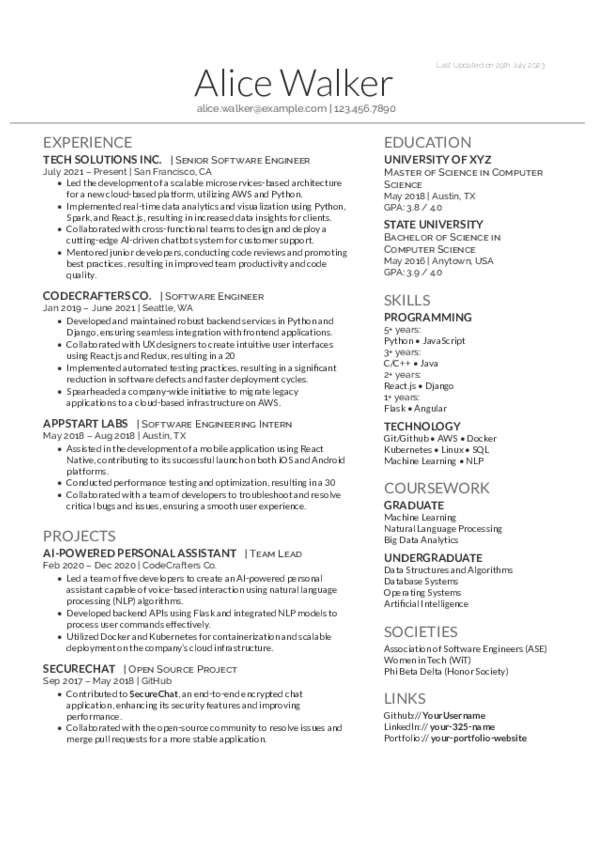
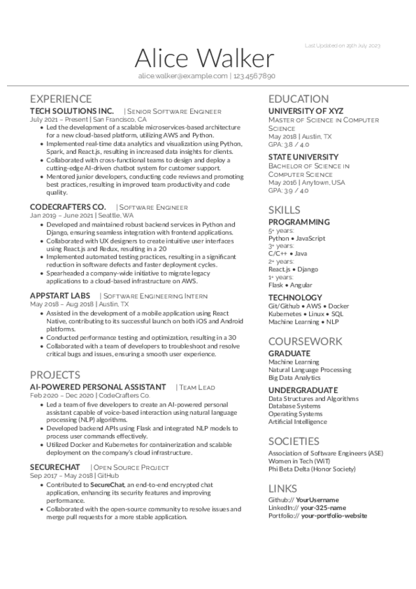

Deedy-Resume-MultiLatex
=========================

A **gray-scale**, **one-page**, **two asymmetric column** resume template in **XeLaTeX** that caters particularly to an **undergraduate Computer Science** student.

As of **v1.3**, a single template is offered that uses free, clean fonts - *Lato* (and its various variants) and *Raleway*.

As of **v1.4**, it is licensed under the MIT License, relicensed from the Apache License 2.0.

## Motivation

This fork of the [Deedy-Resume-Reversed
](https://github.com/ZDTaylor/Deedy-Resume-Reversed) aimed at:

 - ability to compile the source files with different latex compilers
 - changing to MIT License

 The primary reason for this change is to escape the "State Change Condition"
 of the Apache 2.0 license. By switching to the MIT License, I aim to allow
 future derivatives to be released without the requirement of providing the
 full history of changes. This change will make it easier for users to create
 and modify derivatives based on my template.

## Preview

### xelatex

[download pdf](./out/xelatex/deedy-resume-multilatex.pdf)  

### lualatex

   
LuaLaTeX

   [download pdf](./out/lualatex/deedy-resume-multilatex.pdf)  

   

### pdflatex

   
pdfLaTeX

   [download pdf](./out/pdflatex/deedy-resume-multilatex.pdf)  

   

## Dependencies

1. Compiles with **XeLaTeX**, **LuaLaTeX** using provided fonts
1. Compiles **pdfLaTeX** using the respective CTAN font packages:
   - [lato](https://ctan.org/pkg/lato)
   - [raleway](https://ctan.org/pkg/raleway)

## Availability

1. Just clone this repo or download the fonts folder and the .xtx and .cls.
<!--
2. **Overleaf**.com (formerly **WriteLatex**.com) (v1 fonts/colors changed) - [compilable online](https://www.writelatex.com/templates/deedy-resume/sqdbztjjghvz#.U2H9Kq1dV18)
-->

## Changelog
### v1.4
 - Changing license from the Apache License 2.0 to MIT License
 - Isolated fontspec for using only with XeLaTeX and LuaLaTeX compilers
 - Used fontenc for pdfLaTeX compiler
 - Extracted commands to isolate fontspec/fontenc calls
 - Unhid last updated
 - Minor adjustments and cleanup some unused (cite, bib)
 - Files and class renamed to match repo name
 - Replaced resume data with generated content for a fictional character
 - Removed unused commented out sections

### v1.3
 1. Removed MacFonts version as I have no desire to maintain it nor access to macOS
 2. Switched column ordering
 3. Changed font styles/colors for easier human readability
 4. Added, removed, and rearranged sections to reflect my own experience
 5. Hid last updated

### v1.2
 1. Added publications in place of societies.
 2. Collapsed a portion of education.
 3. Fixed a bug with alignment of overflowing long last updated dates on the top right.

### v1.1
 1. Fixed several compilation bugs with \renewcommand
 2. Got Open-source fonts (Windows/Linux support)
 3. Added Last Updated
 4. Moved Title styling into .sty
 5. Commented .sty file.

## Known Issues:
1. Overflows onto second page if any column's contents are more than the vertical limit
2. Hacky space on the first bullet point on the second column.

## License
    Original Work Copyright 2014 Debarghya Das
    Modified Work Copyright 2018 Zachary Taylor
    Modified Work Copyright 2023 multitexlab

    Licensed under MIT License, relicensed from the Apache License 2.0.

    THE SOFTWARE IS PROVIDED "AS IS", WITHOUT WARRANTY OF ANY KIND, EXPRESS OR
    IMPLIED, INCLUDING BUT NOT LIMITED TO THE WARRANTIES OF MERCHANTABILITY,
    FITNESS FOR A PARTICULAR PURPOSE AND NONINFRINGEMENT. IN NO EVENT SHALL THE
    AUTHORS OR COPYRIGHT HOLDERS BE LIABLE FOR ANY CLAIM, DAMAGES OR OTHER
    LIABILITY, WHETHER IN AN ACTION OF CONTRACT, TORT OR OTHERWISE, ARISING FROM,
    OUT OF OR IN CONNECTION WITH THE SOFTWARE OR THE USE OR OTHER DEALINGS IN THE
    SOFTWARE.
